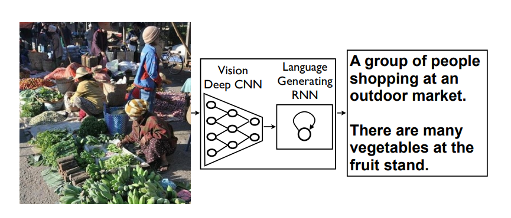

## Heirarchical text generation from visual puzzles

This repository contains the code to generate text from visual puzzles in a heirarchical manner. A subset of tokens is generated during the first pass throught the neural network, then the next subset is generated during the second pass and so on, until the complete text is generated. We pass CNN based embeddings of the visual puzzles  during every pass, and use a Recurrent Neural Network to generate the tokens. 

## Image to text generation: Overview


## Code usage
### Training
```bash
main.py --train_file=data/train.json \
        --val_file=data/val.json \
        --batch_size=128  \
        --nb_epochs=100
```        
### Validation
```bash
eval_cmd.py --model_weights exps/Weights/best.model \
            --dataset data/test.json \
            --output_path exps/Results/TestSet_ \ 
            --beam_size 64 \
            --top_k 10 
``` 
